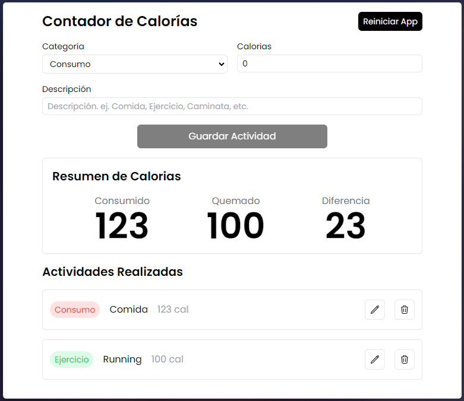
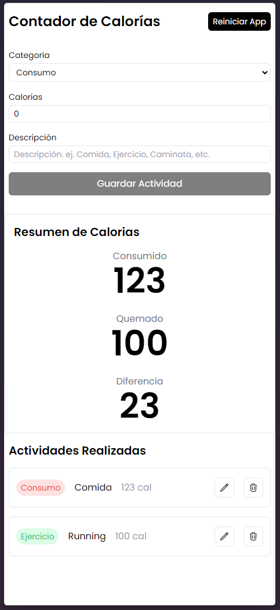

# Calories Counter

A calories counter application built with React and TypeScript, using Vite for fast builds, pnpm as the package manager, and Tailwind CSS for styling. This project was created to practice key React hooks and features and includes a mobile-responsive design.

## Features

- **Calorie Logging**: Allows you to add activities for calorie consumption or burning.
- **Summary**: Displays total calories consumed, burned, and the difference.
- **Activity List**: Shows all logged activities with options to edit or delete each entry.
- **Reset**: Option to reset the entire app.
- **Mobile Responsive**: Optimized for mobile devices for a seamless experience on smaller screens.

## Screenshot




## Technologies

- **React + TypeScript**: Built with TypeScript to enhance type safety and scalability.
- **React Hooks**: Includes use of `useState`, `useEffect`, `useReducer`, and `useMemo` hooks to manage state, side effects, complex state logic, and memoization.
- **Vite**: Fast build tool for frontend applications.
- **pnpm**: Fast and efficient package manager.
- **Tailwind CSS**: CSS framework for building modern, responsive, and customizable UIs.

## Installation

1. Clone the repository:
   ```bash
   git clone git@github.com:germangambarte/calories-tracker.git
   ```

2. Navigate to the project directory:
   ```bash
   cd calorie-tracker
   ```

3. Install dependencies with pnpm:
   ```bash
   pnpm install
   ```

## Running in Development

To start the app in development mode:

```bash
pnpm run dev
```

Open [http://localhost:5173](http://localhost:5173) to view the app in the browser.

## Building for Production

To build the app for production:

```bash
pnpm run build
```

The generated files will be in the `dist` directory.

## Customization

To change the app's styles, modify the `tailwind.config.js` file and the React components. Tailwind allows quick customization of colors, sizes, and other visual elements.

## Contributing

Contributions are welcome! Please open an issue or submit a pull request to improve the app.